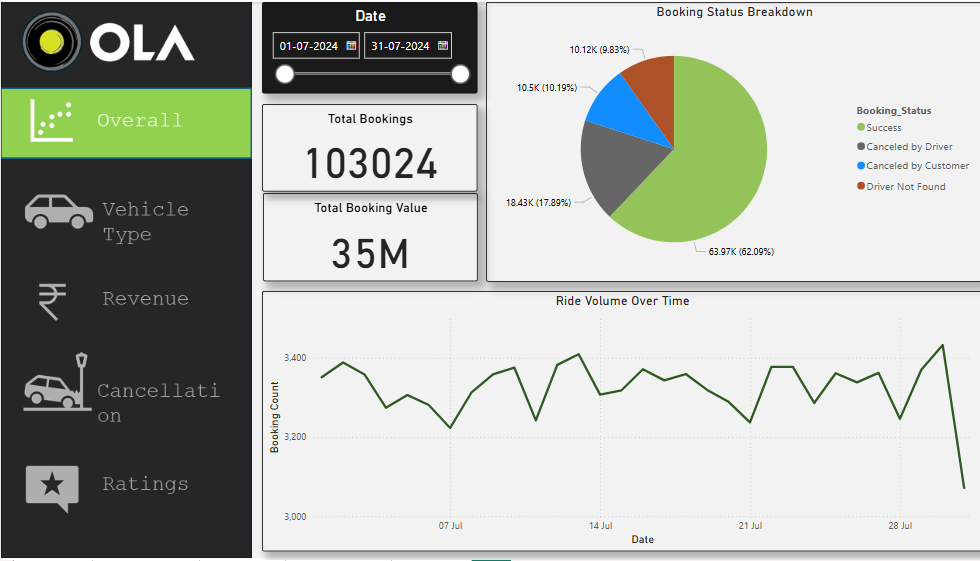
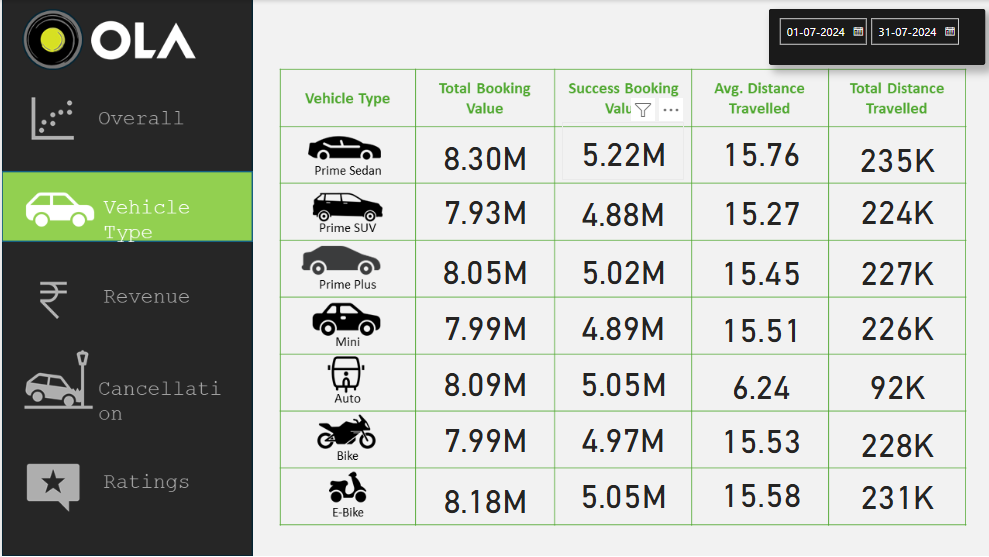
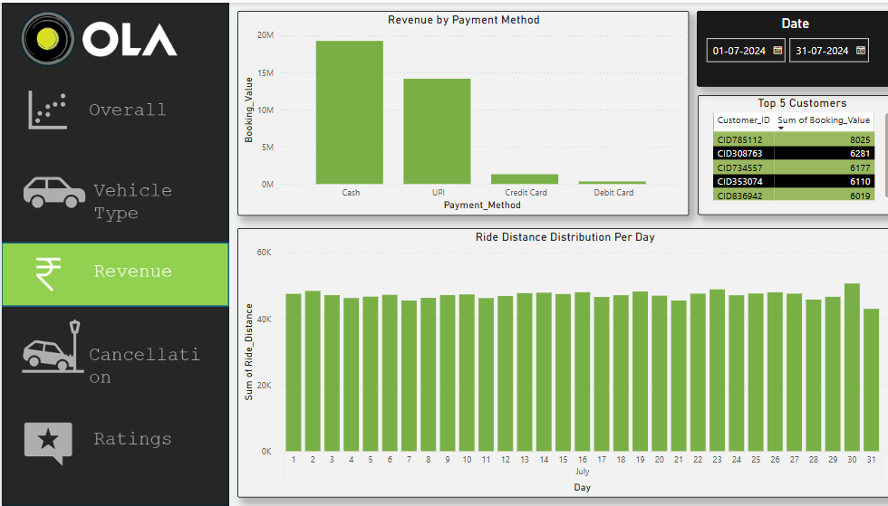
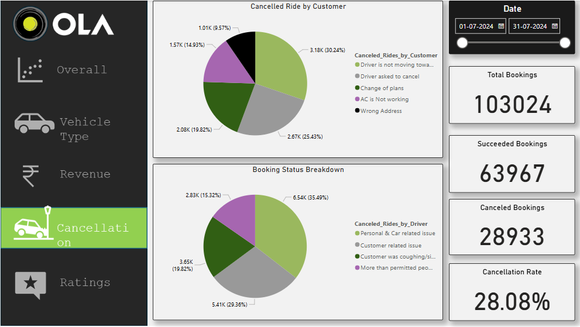

# The-Ola-Dashboard

I hope you’re doing great! I’m thrilled to introduce my latest project, Ola Dashboard, developed using the powerful Power BI tool. This dashboard is a deep dive into booking trends, vehicle types, revenue, cancellations, and ratings—all brought together into an interactive and insightful design.

🔍 Key Features of the Dashboard:

1️⃣ Overview Page:
Total Bookings and Total Booking Values displayed on cards.

A Pie Chart breaking down booking status.

A Line Chart showing ride volume trends over time.

2️⃣ Vehicle Type Page:

A detailed table with insights into Vehicle Type, Total Booking Value, Success Booking Value, and Avg. Distance Travelled.

3️⃣ Revenue Page:

Bar Charts revealing revenue by payment methods and ride distance distribution per day.

A table highlighting the Top 5 Customers.

4️⃣ Cancellation Page:

Pie Charts breaking down canceled rides by customer and booking status.

Cards displaying Total Bookings, Successful Bookings, Canceled Bookings, and Cancellation Rate.

5️⃣ Ratings Page:
A table showcasing Customer Ratings and Driver Ratings.
✨ Interactive Elements:
A menu for seamless navigation between pages.
Slicers on every page to filter data by specific dates—affecting all visuals dynamically.
📊 Interesting Insights:
Overview Page: June saw the highest booking success rate and total bookings.
Vehicle Type Page: Prime Sedan leads with the highest Total Bookings, Successful Bookings, Avg. Distance, and Total Distance Travelled.
Revenue Page: Cash payments contributed the most revenue, and July 30 recorded the longest ride distances.
Cancellation Page: Most customer cancellations occurred due to drivers not moving toward the pickup point, while drivers cited personal and car-related issues for their cancellations.
Ratings Page: Customers gave the highest ratings for Prime Plus, while drivers rated Prime SUV the best.
I am incredibly proud of how this project turned out—it's a blend of clean design, powerful analytics, and actionable insights!
